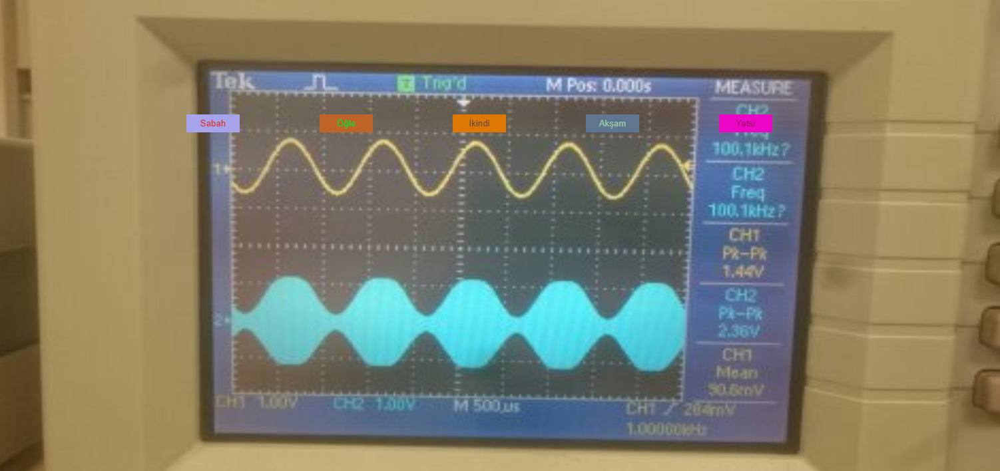

# Şu an nerede _ezan_ okunuyor Türkiye
Zannediyoruz her an dünyanın herhangi bir yerinde ezan okunuyor; biz de Türkiye'de acaba an itibariyle bir yerde ezan okunuyor mu, okunuyorsa nerede okunuyor sorularına yanıt vermeye çalıştık. Program aylık namaz vakitlerini https://www.haberturk.com/namaz-vakitleri sitesindeki verilere göre elde ediyor. Ezanların sabahtan yatsıya sırasıyla 5, 4, 5, 3 ve 5 dakika sürdüklerini varsaydık.

Program temelde 2 kısımdan oluşuyor: internetten veriyi çeken vakitler.py script'i ve verilerin işlendiği, (bayağı basit) arayüzün ortaya çıktığı main.js dosyası. vakitler.py'yi ayda bir çalıştırmak yetiyor, yaslandığı tek 3. taraf kütüphane [Beautiful Soup](https://pypi.org/project/beautifulsoup4/) (scraping mevzusu için), main.js de [p5.js](https://p5js.org)'den nemalanıyor ama 1 MB'dan az olan bu bağımlılık repository'nin içinde. Sonrasında lokal bir server'da (misal node.js'in veya python'un httpserver'ları) [index.html](index.html)'in çalıştırılması programı açmak için yeterli. Yani:

```
cd <Su-an-nerede-ezan-okunuyor-Turkiye>
python3 -m http.server 5151
```
veya

```
cd <Su-an-nerede-ezan-okunuyor-Turkiye>
http-server -c1 -p 5151
```
ve sonrasında
http://localhost:5151

Kullandığımız fotoğraflardan default olan Bilkent EE lablarından bir hatıradır, her şehir için kulanılanları ise https://www.sabah.com.tr/galeri/turkiye/81-il-ile-81-muthis-kare 'den aldık.

Vakitlerin baş harflerine klavyeden tıklamak vakitlerin butonlarına tıklamakla aynı işlevde.

Bu ezanlar-ki şehâdetleri dînin temeli,  
... yurdumun üstünde benim inlemeli.



(butonlar ve yazılarının rengi her yenilemede rastgele değişiyor :p)
